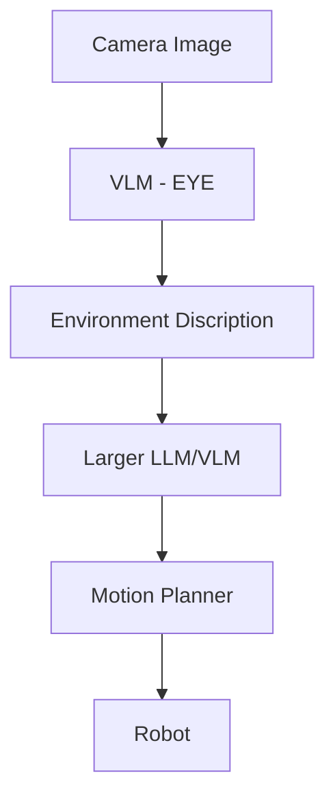

# Multi model based task and motion planning

**Created :** 25/06/2026

---

## Problem 

- A simple VLM based architecture does have semantic reasoning but cannot modify task plans if there are changes in the environment or 
  if there is new data introduced from the images.
  
- Remodifying plans requires giving new images and new prompt to the VLM which would lose it's context and attention gathered in the previous plan with the same task.
  
- A VLM cannot check if the motion plan and task plan are being executed perfectly or how to solve them if there are errors.

---

## Idea 

- We use a VLM as the semantic and visual reasoning model to gather information about the environment from just a few set of images.
- This VlM is called the **EYE** of the architecture as it is a small VLM whose only task is to reason about the environment and all the objects with there relations.
- The Output given by the EYE is then passed onto a larger LLM or VLM which is used to generate the Task plan from all the information given by the EYE.
- The Final output is generated in a Predicate form where the pre-determined tasks which the robot can do are mentioned in the prompt.
- Once the task plan is generated , it is then passed to the Motion planning phase to complete the TAMP.

> The prompt for both the VLM and the LLM is given at the end.

---

## Architecture



---

## Advantages

- This adds continous reasoning to the task and motion planning.
- This improves the accuracy of the task plan in a simple VLM base approach the image tokens occupy most of the space leading to poor results.
- Due to the Fallback architecture the larger model is only activated when it is required rather than a larger model running continiously

---

## Disadvantages

- The Biggest issue is the lost of relations and context when the visual relations and converted to text to send to the LLM.
- Due to the dual model architecture there is high inference time to complete the Compute.
- This also creates more points for hallucination which cause problems in tamp.
- There is a transition overhead when going from one model to another.

---

## Conclusion

A oracle VLM and LLM based architecture would work better than a Pure VLM based approach but as there is loss of Context and High inference time,
no definite conclusions can be made without proper testing.

---

## Insights

The EYE and Brain architecture is a good next step to a pure VLM if we are able to solve the context and time issue.
a proposed solution is to use latent shared memory or Cross attention.

---

> **This is the prompt used for the VLM (EYE)**

``` text
You are a deterministic physical environment parser for a task and motion planning (TAMP) system. 

Look at this image and output a clean, structured text list of the physical facts in the scene. 

You must strictly include:
1. Object Identification: List all visible items, containers, and robot execution targets.
2. Spatial Relations: Detail layout positioning using clear relational terms (e.g., "Mug is ON_TOP_OF Table", "Block_A is INSIDE Box").
3. Physical Obstructions & States: Explicitly note if objects are blocking one another, or if containers are opened/closed (e.g., "Box_Lid is CLOSED", "Chair is BLOCKING the path to the cabinet").
              
The given output will be given to a LLM to Create a task plan which requires a proper understanding of the environment.

CRITICAL: Do not write code, do not format PDDL syntax, and do not generate action plans. Output ONLY the raw structural text list of scene facts.
```

> **This is the prompt given to the LLM(Brain)**

``` text
You are a deterministic robot task planner and sequence logic compiler.

You will receive a structured natural language list of physical environmental facts extracted from a vision system (VLM) along with a high-level user goal. Your job is to parse these variables and compile an optimal, logically sequential robotic execution plan.

---
ENVIRONMENTAL FACTS FROM VLM:
{VLM_response}

USER GOAL:
{goal_object}
---

EXPECTED OUTPUT FORMAT:
You must output exactly two distinct sections. Do not include any meta-commentary, introductory remarks, or conversational filler.

### 1. Extracted Constraints
Analyze the VLM observations and logically list the constraints impacting execution:
- Articulated Blockage: State if doors, lids, or drawers must be operated first.
- Vertical/Spatial Blockage: Explicitly declare the stacking or overlapping order that blocks the target object.
- Kinematic/Physical Access: State specific grasp limitations (e.g., if top-down paths are blocked and side-approaches are mandatory based on the layout).

### 2. Concrete Action Plan
Generate a step-by-step symbolic action sequence using clean primitive declarations: `open()`, `pick()`, and `place()`. 
- Every target action must be preceded by actions that clear its dependencies.
- Use explicit destination markers (e.g., place(blocking_object, destination_location)) ensuring you map items to free space mentioned in the facts.

Format the action steps strictly as:
1. **`action(argument)`** -> Explanatory common-sense reasoning text explaining the physical purpose of this specific primitive step.)
```

---

## Open Questions

- Is it possible to implement Cross attention between 2 models withoput changing there architecture?
- What if all the task plans created by the LLM are not feasible?
- How do we backtrack the VLM when required?
- How do we prevent the loss of image semantic reasoning in the transition?
- Can this architecture improve PDDL generation?

