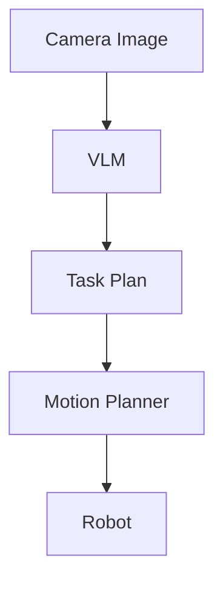

# VLM based Task planning

**Created On :** 24/06/2026

## Problem 

- Traditional Task planning involves algorithms such as RRT* or A* but the main problem with these
  they require a 3D map of the entire world and create a N number of paths which may or maynot be feasible.
  
- Algoritms don't have samantic understanding of the environment and cannot check if there dependencies in the objects.
  
- They cannot solve Long Horizon task planning and are limited to 4-5 tasks.

- They cannot solve problems which involve changes in the envir0nment.

---

## Idea :

- VLM's (Vision language models) can understand the properties and relations in the envienment from just a few images.
- They have high semantic reasoning , They can understand the envirnment better than most algoritms.
- They can help in the task planning by understanding the envirnment and creating a task plan which can then be passed to a Motion Planner.

This works by inputing the VLM an image of the envirnment from the gripper camera or the front camera of a humaniod robot.
By defining all the actions the robot can in the form of predicates to the VLM with the goal object ,
The VlM would genereate a task plan and it's understandihg of the environment.

> The prompt used in a basic prototype is mentioned at the end of document.

---

## Architecture

---

## Advantages

- Due to the VLM's resoning it is abel to generate a Task plan with higher accuracy than general algorithms.
- The envirnment Discription can be used again to generate the PDDL File (PLnaning domain defination language)
- 

