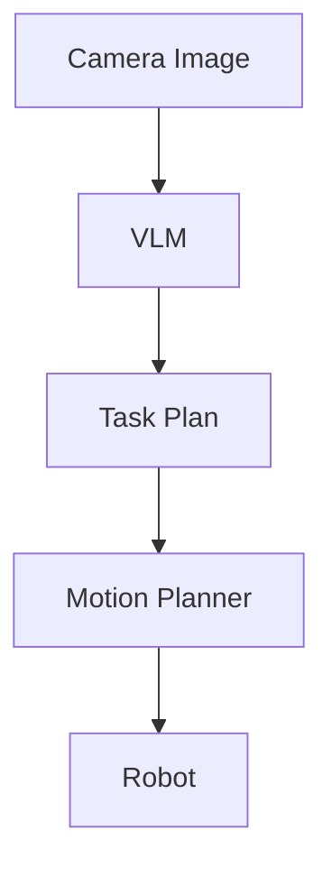

# VLM based Task planning


**Created On :** 24/06/2026

## Problems

- Traditional Task planning involves algorithms such as RRT* or A* but the main problem with these
  they require a 3D map of the entire world and create a N number of paths which may or maynot be feasible.
  
- Algoritms don't have semantic understanding of the environment and cannot check if there are dependencies for the objects.
  
- They cannot solve Long Horizon task planning and are limited to 4-5 tasks.

- They cannot solve problems which involve changes in the environment.

---

## Idea :

- VLM's (Vision language models) can understand the properties and relations in the environment from just a few images.
- They have high semantic reasoning , They can understand the envirnment better than most algoritms.
- They can help in the task planning by understanding the envirnment and creating a task plan which can then be passed to a Motion Planner.

This works by inputing the VLM an image of the envirnment from the gripper camera or the front camera of a humaniod robot.
By defining all the actions the robot can perform in the form of predicates to the VLM with the goal object ,
The VlM would genereate a task plan and it's understandihg of the environment.

> The prompt used in a basic prototype is mentioned at the end of document.

---

## Architecture



---

## Advantages

- Due to the VLM's resoning it is abel to generate a Task plan with higher accuracy than general algorithms.
- The envirnment Discription can be used again to generate the PDDL File (Planning domain defination language)

---

## Disadvantages

- The VlM always has the disadvantage of hallucinating a solution when it doesn't have enough world knowledge.
- It doesn't have adaptive change in task plan which means it cannot process when there are changes in the environment.
- The task plan can still be infeasible which still needs be checked by the motion plan.

---

## Conclusion

Even tho VLM's have disadvantages they are the next best steps after algorithms as they can still do long horizon task planning.
by using the VLM as the eyes of the task planing and using it to generate a PDDL file which can be evaluated by the motion planner.

---

## Insights 

The VLM architecture would work but by adding a LLM or another VLM as the main task planner and using a small VLM as the eyes which would determine
changes in the envirnonment and call for the Bigger VLM task planning only when there is drastic change in the environment.

---

>This is a prompt used for a VLM task planner

```text

You are an advanced AI Robot Task Planner operating in a 3D tabletop environment. 
Your goal is to analyze the provided image and generate a collision-free, logically sound sequential task plan to retrieve the target object.

### Target Object
Target: {goal_object}

### Robot Kinematic Capabilities (Action Space)
Only use the following parameterized actions. Do not invent new actions.
- pick(object): Grasp an object from the side (top-down grasps are physically blocked).
- place(object, location): Place a held object onto a stable surface location.
- move(object, direction): Shift an object linearly.
- slide(object, direction): Slide an object along a surface without lifting.
- push(object, direction) / pull(object, direction): Apply lateral force.
- open(object) / close(object): Operate articulated joints (drawers, lids, doors).

*Note: For 'direction', use relative egocentric terms: [left, right, forward, backward, up, down].*

### Environmental & Physics Constraints
1. **Grasp Obstruction:** If an object is inside a container, drawer, or under a lid, the container must be `open(object)` before a `pick` is attempted.
2. **Clearance Rule:** If an object is stacked beneath or directly blocked by another object, the obstructing object(s) must be cleared first.
3. **Stability Guard:** Do not generate any action that violates gravity or causes ungrasped objects to fall, tip over, or become unstable.
4. **Efficiency:** Minimize the total number of actions. Do not move objects that do not directly or indirectly block the target object.

Output Format:

1. Scene Description: List objects and their spatial relations (e.g., "A is inside B").
2. Constraints: Identify blocking objects and why the target isn't immediately accessible.
3. Action Plan:
   1. [Action] -> [Expected world state change]
   2. [Action] -> [Expected world state change]

```

---

## Open Questions

- Can confidence be estimated during VLM reasoning?
- What is the optimal representation between perception and symbolic planning?
- Can observer models reduce planner invocation frequency?
- How should dynamic scene changes be represented?
- Can shared world representations improve PDDL generation?


