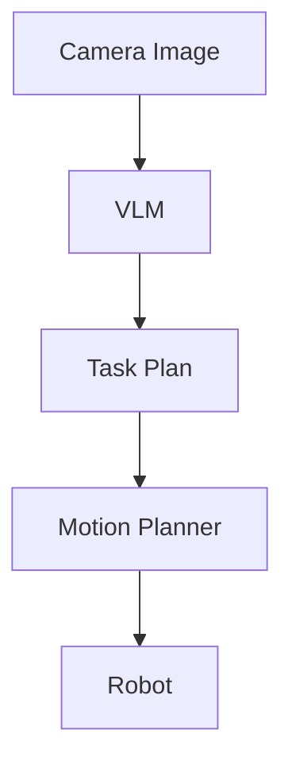

# Prototype - 1

---

# Vision language model based Task Planning

**Created :** 27/06/2026

---

## Objective:

The objective of this prototype is to implement a VLM based architecture which would take an image of the scene and prompt which contains the goal object ,
It should be able to provide a scene discription as well as find all the relations between objects.
From the above results it will also be able to develop a task plan in the form of predicates.
The following is an example:

1. **pick(robotics_book)** -> The front-most book is grasped from its sides.
2. **place(robotics_book, right_forward_table)** -> The `robotics_book` is moved to a clear space on the table to prevent visual or physical obstruction.
3. **pick(stack_of_papers)** -> The vertical stack of documents is removed.
4. **place(stack_of_papers, left_forward_table)** -> The `papers` are cleared from the primary retrieval path.
5. **pick(brother_ink_bottle)** -> With the frontal workspace clear, the robot approaches and side-grasps the `Brother ink bottle` successfully.

> A few more examples with there outputs and the prompt are mentioned at the end of document.

---

## Idea :

- Due to the high visual and semantic reasoning of a VLM they can be used to generate task plans which can then be sent to motion planning to check there feasibility.
- By designing a clear prompt on what tasks must be done and what actions are allowed the VLM can generate a proper motion plan .
- An inference Timer has also been added in the code to act as a measurement of time taken.

---

## Experimental Setup

Model: Gemini Robotics ER 1.6 Preview

Input:
- RGB Image
- Goal Object

Output:
- Scene Description
- Constraints
- Symbolic Task Plan

Latency Measurement:
Python `time.perf_counter()`

---

## Architecture :



---

## Conclusion :

After performing a few experiments on the accuracy of the task plan and the time taken . Here are the insights i found :

- VlM based architectures are the better at planning long horizon task plans.
- Due to the current limitations of using a API based VLM there is high inference time of upto 25 sec.

Reference : [VLM based TAMP](Ideas/VLM_Based_TAMP.md)
> The above document contains all the details including its pros and cons.

---

## Prompt :

```text
You are an advanced AI Robot Task Planner operating in a 3D tabletop environment. 
Your goal is to analyze the provided image and generate a collision-free, logically sound sequential task plan to retrieve the target object.

### Target Object
Target: {goal_object}

### Robot Kinematic Capabilities (Action Space)
Only use the following parameterized actions. Do not invent new actions.
- pick(object): Grasp an object from the side (top-down grasps are physically blocked).
- place(object, location): Place a held object onto a stable surface location.
- move(object, direction): Shift an object linearly.
- slide(object, direction): Slide an object along a surface without lifting.
- push(object, direction) / pull(object, direction): Apply lateral force.
- open(object) / close(object): Operate articulated joints (drawers, lids, doors).

*Note: For 'direction', use relative egocentric terms: [left, right, forward, backward, up, down].*

### Environmental & Physics Constraints
1. **Grasp Obstruction:** If an object is inside a container, drawer, or under a lid, the container must be `open(object)` before a `pick` is attempted.
2. **Clearance Rule:** If an object is stacked beneath or directly blocked by another object, the obstructing object(s) must be cleared first.
3. **Stability Guard:** Do not generate any action that violates gravity or causes ungrasped objects to fall, tip over, or become unstable.
4. **Efficiency:** Minimize the total number of actions. Do not move objects that do not directly or indirectly block the target object.

Output Format:

1. Scene Description: List objects and their spatial relations (e.g., "A is inside B").
2. Constraints: Identify blocking objects and why the target isn't immediately accessible.
3. Action Plan:
   1. [Action] -> [Expected world state change]
   2. [Action] -> [Expected world state change]
```

---

## Outputs :

## Example - 1 :


```text
Enter goal object: deep learning book 
### 1. Scene Description:
The scene consists of a wooden bookshelf with a glass cabinet door.
- **Glass door:** Currently closed, obstructing all objects inside.
- **Shelf interior:** Contains a row of spiral-bound **notebooks** on the left side.
- **Books:** On the right side, there is a set of books standing vertically:
    - **Robotics book:** The leftmost book in the right group.
    - **Hands-On Machine Learning book:** Located between the robotics book and the target.
    - **Deep learning book (Target):** Positioned between the ML book and another item to its right.
    - **Miscellaneous books:** To the right of the deep learning book.
- There is a clear horizontal space between the notebooks and the vertical books.

### 2. Constraints:
- **Grasp Obstruction:** The target **deep learning book** is behind the glass door. The `open(glass_door)` action must be performed first.
- **Access Rule:** To `pick(object)` with side access, lateral space must be available for the robot's end-effector. The target is currently sandwiched between other books.
- **Efficiency:** Clear the minimum number of objects to create enough space for a lateral pick.

### 3. Action Plan:
1. **open(glass_door)** -> The interior of the cabinet is now accessible.
2. **move(robotics_book, left)** -> Shifts the thin robotics book towards the notebooks, creating slack in the book row.
3. **move(hands_on_machine_learning_book, left)** -> Shifts the thick ML book to the left, creating lateral space around the **deep learning book**.
4. **pick(deep_learning_book)** -> Securely grasps the target from the sides and retrieves it from the shelf.
```

> Time taken : 18.6 sec
---

## Example - 2 :


```text
Enter goal object: Brother ink bottle
### Scene Description
1. **Robotics book (Control, Sensing, Vision, and Intelligence):** Located at the front of the stack, oriented vertically facing the viewer.
2. **Stack of papers/folders:** Positioned directly behind the `Robotics book`.
3. **Deep Learning book/container:** Located behind the `stack of papers`, partially visible.
4. **Blue patterned box/binder:** Situated behind the `Deep Learning book`.
5. **Brother ink bottle (box):** Target object, resting on top of the `blue patterned box`.
6. **Lamp:** Located to the right of the entire stack.
7. **Small gold statue/ornament:** Located to the left of the stack.

### Constraints
1. **Physical Obstruction:** The `Brother ink bottle` is physically positioned behind the `Robotics book` and `stack of papers`. While it sits higher, side-grasping it (as required by robot capabilities) would likely be impeded by the high vertical profile of the objects in front.
2. **Stability Guard:** Removing objects from the front stack must be done carefully. The `Robotics book` appears to be leaning against the `papers`.
3. **Target Clearance:** To ensure a successful side grasp on the `Brother ink bottle` without knocking over adjacent items (like the Deep Learning item), space in front should be cleared to allow kinematic approach.

### Action Plan
1. **pick(robotics_book)** -> The front-most book is grasped from its sides.
2. **place(robotics_book, right_forward_table)** -> The `robotics_book` is moved to a clear space on the table to prevent visual or physical obstruction.
3. **pick(stack_of_papers)** -> The vertical stack of documents is removed.
4. **place(stack_of_papers, left_forward_table)** -> The `papers` are cleared from the primary retrieval path.
5. **pick(brother_ink_bottle)** -> With the frontal workspace clear, the robot approaches and side-grasps the `Brother ink bottle` successfully.
```

> Time taken : 20.8 sec 
---

## Current Limitations

- API latency (~20 s)
- Single-image reasoning
- No execution feedback
- No confidence estimation

